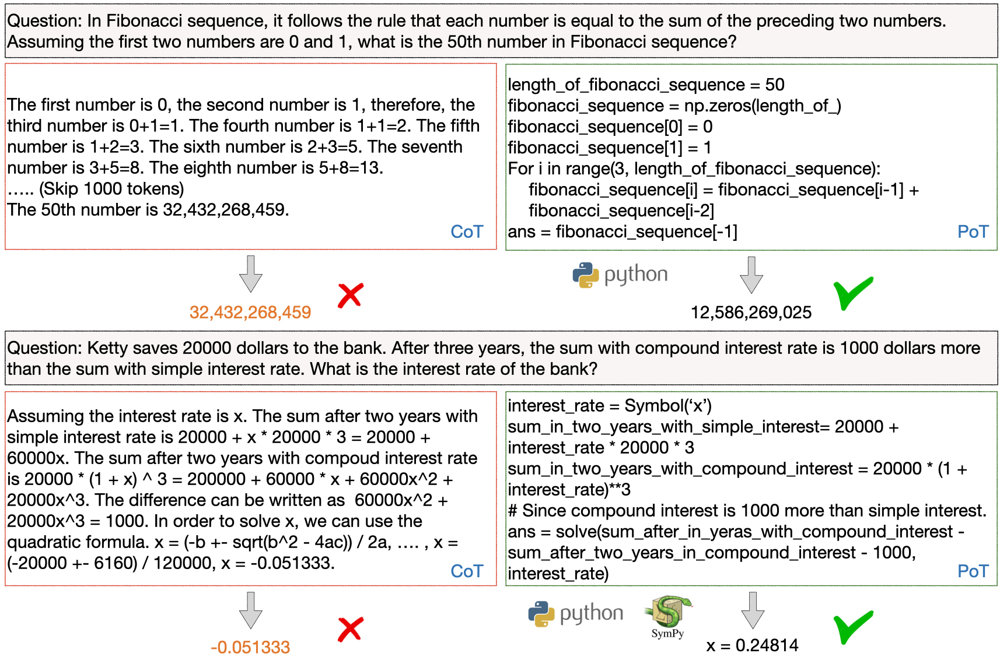
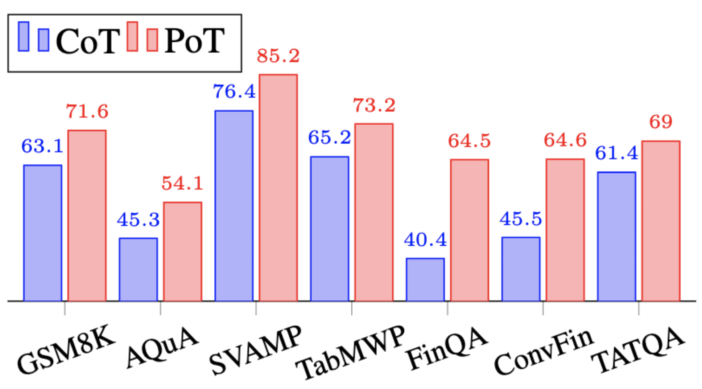
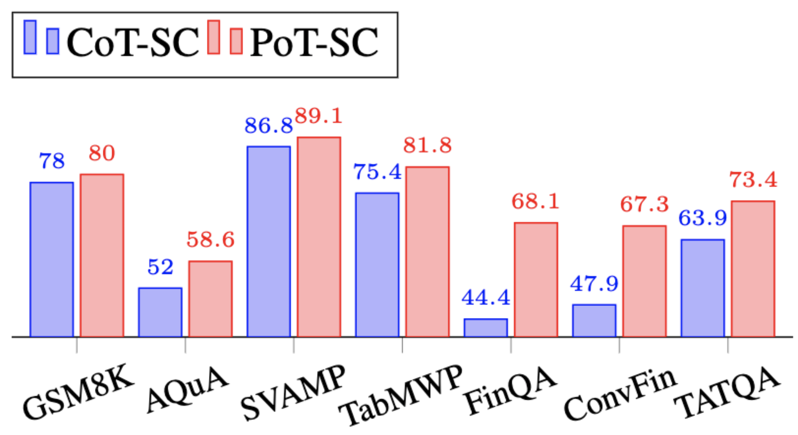
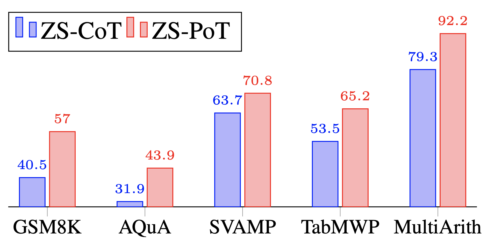

## Program of Thoughts
This is code repository for the TMLR2023 paper [Program of Thoughts Prompting: Disentangling Computation from Reasoning for Numerical Reasoning Tasks](https://arxiv.org/abs/2211.12588). 

We propose to disentangle computation and reasoning from in the problem solving process. The large language model only needs to express the thoughts using Python program, the computation and solving process is accomplished via an external Python Interpreter. 

<p align="center">

</p>

1. We outperform few-shot CoT by an average of 12% on all the datasets evaluated.
2. We outperform zero-shot CoT also by an average of 12% on all the datasets evaluated.
3. We achieve SoTA performance with self-consistency decoding on all the evaluated math word problem datasets (GSM8K, AQuA, SVAMP, TabMWP, MultiArith).

Comparison with Few-shot CoT:
<p align="center">

</p>

Comparison with Few-shot CoT with self-consistency:
<p align="center">

</p>

Comparison with Zero-shot CoT:
<p align="center">

</p>

## News

1. Added CoT evaluation for AQuA QA for GPT4, the accuracy is 72.7%
2. Adding [Benchmark](https://github.com/wenhuchen/Program-of-Thoughts/blob/main/benchmark.md)

## Running the code

First you need to specify your OPENAI key
```
export OPENAI_KEY = [YOUR_KEY]
```

- Few-shot + Greedy
```
python run_gsm8k.py --greedy
python run_aqua.py --greedy
...
```
- Few-shot + Self-Consistency
```
python run_gsm8k.py
python run_aqua.py
...
```
-  Zero-shot
```
python run_gsm8k_zs.py
python run_aqua_zs.py
...
```

The prediction file will be dumped in the outputs/ folder, let's say gsm8K_s0_e-1_11_17_10_20.jsonl, or gsm8K_sc_s0_e-1_11_08_21_14.jsonl, or  gsm8K_zs_s0_e-1_11_19_09_55.jsonl.

- Evaluation
```
cd outputs
python compute_score.py --inputs gsm8K_s0_e-1_11_17_10_20.jsonl
python compute_score.py --inputs aqua_s0_e-1_11_06_18_38.jsonl
python compute_score.py --inputs svamp_s0_e-1_11_06_21_11.jsonl
....
```

## Few-shot Results

1. GSM8K
- Number of Test Examples: 1318
- Output: outputs/gsm8K_s0_e-1_11_17_10_20.jsonl
- EM Score: 0.716

- Output: outputs/gsm8K_sc_s0_e-1_11_08_21_14.jsonl
- EM Score: 0.799

2. AQuA
- Number of Test Examples: 253
- Output: outputs/aqua_s0_e-1_11_06_18_38.jsonl
- EM Score: 0.541

- Output: aqua_sc_s0_e-1_11_07_20_49.jsonl
- EM Score: 0.582

3. SVAMP
- Number of Test Examples: 1000
- Output: outputs/svamp_s0_e-1_11_24_14_38.jsonl
- EM Score: 0.852

- Output: outputs/svamp_sc_s0_e-1_11_24_15_54.jsonl
- EM Score: 0.891

4. TabWMP
- Number of Test Examples: 7861
- Output: outputs/tabmwp_s0_e-1_11_06_22_55.jsonl
- EM Score: 0.732

- Output: outputs/tabmwp_sc_s0_e-1_11_08_18_21.jsonl
- EM Score: 0.818

5. FinQA
- Number of Test Examples: 1147 
- Ouptut: outputs/finqa_s0_e-1_11_16_13_29.jsonl
- EM Score: 0.647

- Output: outputs/finqa_sc_s0_e-1_11_09_13_00.jsonl
- EM SCore: 0.682


6. ConvFinQA
- Number of Test Examples: 421 
- Ouptut: outputs/convfinqa_s0_e-1_11_12_01_38.jsonl
- EM Score: 0.665

- Output: outputs/convfinqa_sc_s0_e-1_11_12_02_27.jsonl
- EM SCore: 0.714

7. TATQA
- Number of Test Examples: 1668 
- Output: outputs/tatqa_8shot_11_06_19_53.json
- EM Score: 0.689

- Output: outputs/tatqa_8shot_11_06_19_53.json
- EM Score: 0.702


## Zero-shot Results


1. GSM8K
- Number of Test Examples: 1318
- Output: outputs/gsm8K_zs_s0_e-1_11_19_09_55.jsonl
- EM Score: 0.569

2. AQuA
- Number of Test Examples: 253
- Output: outputs/aqua_zs_s0_e-1_11_19_11_56.jsonl
- EM Score: 0.438
```
python compute_score.py --inputs aqua_zs_s0_e-1_11_19_11_56.jsonl --relaxed
```
3. SVAMP
- Number of Test Examples: 1000
- Output: outputs/svamp_zs_s0_e-1_11_18_20_12.jsonl
- EM Score: 0.708

4. MultiArith
- Number of Test Examples: 600
- Output: outputs/multiarith_zs_s0_e-1_11_19_20_12.jsonl
- EM Score: 0.922

5. TabMWP
- Output: outputs/tabmwp_zs_s0_e-1_11_19_20_01.jsonl
- EM Score: 0.646


## Cite our Work
```
@article{chen2022program,
  title = {Program of Thoughts Prompting: Disentangling Computation from Reasoning for Numerical Reasoning Tasks},
  author = {Wenhu Chen and Xueguang Ma and Xinyi Wang and William W. Cohen},
  journal={arXiv preprint arXiv:2211.12588},
  year = {2022},
}
```
